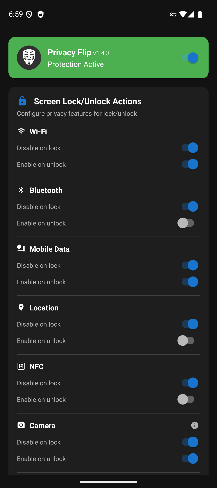
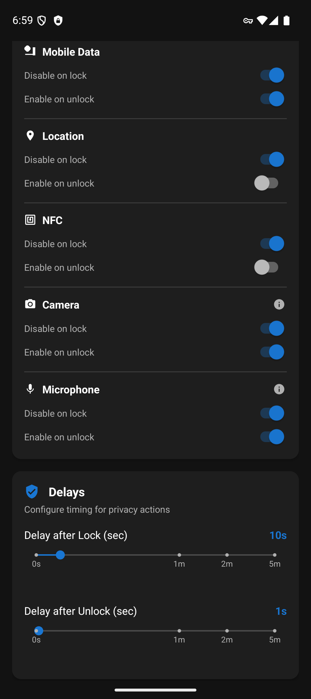

# PrivacyFlip

**Automatic lock/unlock privacy control for Android devices 🔐📱✨**

**PrivacyFlip** automatically manages your Android device's privacy features based on lock/unlock state. When you lock your device, it can disable **Wi-Fi**, **Bluetooth**, **mobile data**, **location** services, **NFC**, and even **camera/microphone sensors**. When you unlock, it intelligently restores the features you want back on.

**Requires Shizuku** - works on non-rooted devices via ADB-level permissions.

   
   
  

## 📸 Screenshots

  
  

## 🔒 Features

### **Automatic Privacy Control**
- **Lock Detection**: Instantly disables privacy features when screen locks
- **Unlock Detection**: Waits for proper authentication (not just screen-on)
- **Smart Restoration**: Configurable feature re-enabling on unlock

### **Privacy Features Controlled**
- 📶 **Wi-Fi** - Disable/enable wireless connectivity
- 📱 **Bluetooth** - Control Bluetooth radio
- 📡 **Mobile data** - Manage cellular data connection
- 📍 **Location services** - Control GPS and location tracking
- 📳 **NFC** - Control Near Field Communication sensor
- 📷 **Camera** - Disable/enable camera sensor privacy (Android 12+)
- 🎤 **Microphone** - Disable/enable microphone sensor privacy (Android 12+)
- ✈️ **Airplane Mode** - Enable airplane mode on lock (opt-in, disables all radios)
- 🔋 **Battery Saver** - Enable battery saver mode on lock (opt-in)

### **Advanced Features**
- **Smart Disable Options**:
  - **"Only if unused/not connected"** - Don't disable WiFi, Bluetooth, or Location if actively in use
  - **"Only if not already enabled"** - Prevent connection resets by not re-enabling features that are already on
  - **"Only if not manually set"** - Respect manually enabled protection modes on unlock

- **App Exemptions** - Exclude specific apps from privacy actions when in foreground
- **Samsung NFC Auto-Retry** - Opt-in feature to combat Samsung payment framework NFC override (for Galaxy S, Note, Z series)
- **Accessibility Service** - Experimental support for side/power button instant-lock (opt-in, requires Accessibility permission)
- **Advanced Detection** - Multi-tier Bluetooth connection detection prevents unwanted headphone disconnects

### **Customizable Timing**
- **Lock Delay**: 0-60 seconds (granular), 2 minutes, or 5 minutes before privacy actions trigger
- **Unlock Delay**: 0-60 seconds (granular), 2 minutes, or 5 minutes before features are restored
- **Instant Mode**: Set delays to 0 for immediate action
- **Note**: Camera and microphone ignore custom delays and trigger immediately, due to Android limitations

## 📱 Requirements

**Minimum:** Android 7.0+ (API level 24)
**Camera/Microphone Features:** Android 12+ (API level 31)

**Requirements:**

- **Shizuku** app installed and running
- **ADB privileges** via USB debugging or wireless ADB
- No root required

## 🤝 Contributing

Help make this app better. No contribution is too small!

### How to Contribute

1. **Fork the repository**
2. **Create a feature branch** (`git checkout -b feature/amazing-feature`)
3. **Make your changes**
4. **Commit your changes** (`git commit -m 'Add some amazing feature'`)
5. **Push to the branch** (`git push origin feature/amazing-feature`)
6. **Open a Pull Request**

All contributions are **valued** and **appreciated**!

## 📄 License

This project is licensed under the MIT License - see the [LICENSE](LICENSE) file for details.

## 💖 Support Development

PrivacyFlip protects your privacy. You can protect its future!

---

*Late nights for brighter days*

Created by Doru Moraru
